# Real-Time Gait Analysis Robot - Interactive Demo Concept

## Overview
A 3D interactive demonstration showcasing an AI-integrated robotic gait analysis system that combines custom hardware sensors with real-time AI processing to analyze human movement patterns. This demo perfectly embodies Northlake Labs' "AI-first robotics" approach and hardware-software integration philosophy.

## Core Concept: "Real-Time Gait Analysis with AI"
An interactive web demonstration showing a human figure walking while a robotic sensor system analyzes gait patterns in real-time using machine learning. Users can modify walking parameters (speed, asymmetries, perturbations) and watch how the AI responds with live analysis and insights. The demo showcases real-time data visualization of ground reaction forces and joint angles, with ML algorithms providing continuous pattern recognition and analysis feedback.

---

## 🎯 Visual Design & User Experience

### Main Scene Layout

```mermaid
graph TB
    subgraph "3D Scene Area"
        A[🚶‍♂️ Walking Human Figure<br/>Animated Gait Cycle] 
        B[🤖 Robot Sensor Array<br/>Real-time Data Collection]
        A -.->|Movement Data| B
    end
    
    subgraph "Real-Time Data Visualization"
        C[Ground Reaction Forces]
        D[Joint Angle Plots]
        E[Gait Cycle Timing]
        F[Step-by-Step Analysis]
    end
    
    subgraph "ML Analysis Engine"
        G[Pattern Recognition]
        H[Asymmetry Detection]
        I[Real-time Insights]
    end
    
    subgraph "User Controls"
        J[Walking Speed Slider]
        K[Asymmetry Controls]
        L[Perturbation Button]
    end
    
    B -->|Sensor Data| C
    B -->|Sensor Data| D
    B -->|Sensor Data| E
    C --> G
    D --> G
    E --> G
    G --> H
    H --> I
    I --> F
    
    J --> A
    K --> A
    L --> A
    
    style A fill:#eb5b48,stroke:#fff,color:#fff
    style B fill:#5c37a9,stroke:#fff,color:#fff
    style G fill:#585ccc,stroke:#fff,color:#fff
    style H fill:#585ccc,stroke:#fff,color:#fff
    style I fill:#585ccc,stroke:#fff,color:#fff
```



### Interactive Elements

#### 1. User Controls
- **Walking Speed Slider**: Continuous adjustment from slow walk to fast run
- **Asymmetry Controls**:
  - Left leg timing adjustment
  - Right leg timing adjustment
  - Force imbalance simulation
  - Limp simulation toggle
- **Perturbation Button**: 
  - Temporary stumble/disruption
  - Recovery analysis
  - Trip simulation

#### 2. Real-Time Data Visualization
- **Ground Reaction Force Plots**:
  - Live force curves for each step
  - Left vs right comparison
  - Peak force indicators
  - Contact time visualization
- **Joint Angle Charts**:
  - Hip, knee, ankle angles through gait cycle
  - Real-time angle traces
  - Range of motion indicators
  - Symmetry comparisons
- **Gait Cycle Analysis**:
  - Step timing breakdown
  - Stride length measurements
  - Cadence tracking
  - Phase duration analysis

#### 3. Robot Sensor System
- **Multi-Sensor Array**:
  - Force plates under each foot
  - Motion capture cameras tracking joints
  - IMU sensors on body segments
  - Real-time data streaming visualization
- **Data Flow Animation**:
  - Particle streams from sensors to processing unit
  - Color-coded data types (force, position, acceleration)
  - Processing queue visualization
- **ML Processing Indicators**:
  - Active analysis status
  - Processing confidence levels
  - Pattern recognition alerts

---

## 🧠 AI Components & Intelligence Display

### Real-Time Analysis Modules

#### 1. Gait Pattern Recognition
- **Visual Representation**: Live step timing and rhythm analysis with continuous feedback
- **ML Insights**: 
  - "Step symmetry: 92% (detecting 0.08s timing difference between legs)"
  - "Gait pattern consistency: 94% confidence"
  - "Stride length variability: 4.2cm ± 1.1cm"
- **Research Value**: Real-time quantification of movement patterns as they occur

#### 2. Ground Reaction Force Analysis  
- **Visual Representation**: Live force curves updating with each step
- **ML Insights**:
  - "Peak force asymmetry: 15% higher on right leg"
  - "Contact time difference: 0.03s detected"
  - "Force loading rate: within normal parameters"
- **Research Value**: Immediate force analysis for each step cycle

#### 3. Joint Kinematics Tracking
- **Visual Representation**: Real-time joint angle plots through gait cycle
- **ML Insights**:
  - "Knee flexion range: L=45°, R=38° (7° asymmetry detected)"
  - "Hip extension: 18° peak angle (normal range 15-20°)"
  - "Ankle dorsiflexion: consistent 15° across cycles"
- **Research Value**: Precise kinematic measurements for biomechanical analysis

#### 4. Machine Learning Pattern Detection
- **Visual Representation**: AI confidence indicators and pattern recognition alerts
- **ML Insights**:
  - "Asymmetric pattern detected with 87% confidence after 8 steps"
  - "Compensatory strategy identified in stance phase"
  - "Movement adaptation observed following perturbation"
- **Research Value**: AI-powered pattern recognition that human observers might miss

#### 5. Real-Time Adaptation Analysis
- **Visual Representation**: Before/during/after comparisons when parameters change
- **ML Insights**:
  - "Speed increase → stride length +12%, cadence +8%"
  - "Perturbation recovery: normal pattern restored in 3 steps"
  - "Asymmetry introduction → compensatory adjustments detected"
- **Research Value**: Live analysis of movement adaptation and motor control

### AI "Thinking" Visualization


- **Neural Network Animation**: Simplified neural network showing data processing flow
- **Confidence Building**: Real-time confidence bars that update as more data is processed
- **Processing States**: 
  - "AI is analyzing gait pattern..."
  - "Comparing to normative database..."
  - "Calculating statistical measures..."
  - "Generating data summary..."
- **Decision Tree**: Visual representation of AI decision-making process for risk assessment

---

## 🛠 Technical Implementation Strategy

### Technology Stack & Architecture


### Performance-First Implementation Plan

#### Recommended Libraries & Tools
- **3D Rendering**: React Three Fiber + Drei (lightweight Three.js wrapper)
- **Charts**: Chart.js with streaming plugin (optimal for real-time data)
- **Animation**: Framer Motion for UI animations, custom systems for gait cycles
- **State Management**: Zustand (lightweight, fast updates)
- **Performance**: React.memo, useMemo, useCallback for optimization

### Core Implementation Components

#### 1. 3D Scene (Optimized for Performance)
```typescript
// Efficient 3D Implementation Strategy
Component Structure:
- Human Figure: Stylized rigged model with IK constraints
- Robot Sensors: Simple geometric primitives with glow effects
- Environment: Minimal scene - treadmill platform only
- Lighting: Baked lighting with real-time highlights for sensors

Animation System:
- Pre-computed gait cycle keyframes (60fps interpolation)
- Real-time parameter blending for speed/asymmetry adjustments
- Efficient bone transforms using quaternions
- LOD system: reduce complexity on lower-end devices

Performance Targets:
- 60fps on desktop, 30fps on mobile
- <100 draw calls total
- Instanced rendering for sensor arrays
- Frustum culling and occlusion optimization
```

#### 2. Real-Time Data Visualization
```typescript
// Chart Performance Strategy
Data Management:
- Circular buffers: 500 data points max per chart
- 60fps update rate with interpolation smoothing
- Efficient canvas rendering (avoid SVG for real-time)
- Multiple chart types: line, bar, scatter, heatmap

Chart Libraries Evaluation:
- Chart.js: Best for smooth streaming data ✓
- D3.js: Too complex for real-time performance ❌  
- Plotly: Good features but heavier bundle ❌
- Custom Canvas: Most performant but time-intensive ❌

Implementation:
- Chart.js with streaming plugin
- Custom data point management
- Efficient redraw strategies
- Export capabilities (PNG, CSV, JSON)
```

#### 3. ML Simulation Engine (Realistic Behavior)
```typescript
// Authentic AI Behavior Modeling
Pattern Recognition Algorithms:
- Symmetry Index: (|L-R|/(L+R)) * 100
- Cadence Variability: Coefficient of variation over 10 steps
- Ground Contact Time: Stance phase percentage analysis
- Joint ROM: Peak-to-peak amplitude calculations

Confidence Modeling:
- Bayesian confidence updates with each gait cycle
- Realistic processing delays (100-300ms)
- Uncertainty quantification for each metric
- Multi-model ensemble simulation

Real-time Processing:
- Web Workers for heavy calculations
- 60fps main thread for smooth UI
- Async pattern recognition updates
- Streaming data pipeline architecture
```

#### 4. Interactive Control System
```typescript
// User Experience Framework
Control Design:
- Immediate visual feedback (<16ms response)
- Smooth parameter interpolation
- Contextual help tooltips
- Keyboard shortcuts for power users

Parameter Systems:
- Speed: 0.5-2.5 m/s with realistic gait adaptation
- Asymmetry: Temporal (timing) and kinetic (force) variations
- Perturbations: Trip recovery, external force responses
- Preset scenarios: Clinical cases and research examples

State Management:
- Zustand for lightweight, fast state updates
- Immutable data patterns for predictable updates
- Real-time parameter streaming to animation system
- History tracking for comparison features
```

### Development Implementation Roadmap


### Recommended Next Steps

#### Immediate Actions (This Week)
1. **Set up React Three Fiber environment** in existing Astro project
2. **Install required dependencies**: @react-three/fiber, @react-three/drei, chart.js
3. **Create basic component structure** for the demo
4. **Implement simple 3D scene** with camera controls

#### Short-term Goals (Weeks 1-2)
1. **Human figure model**: Find/create optimized rigged character
2. **Basic gait animation**: Implement walking cycle with IK
3. **Chart integration**: Set up Chart.js for real-time data
4. **Control panel**: Build parameter adjustment interface

#### Technical Decisions Needed
1. **Human Model Source**: Custom creation vs purchased asset vs open source
2. **Animation Approach**: Keyframe interpolation vs physics simulation
3. **Chart Library Final Choice**: Chart.js vs custom canvas implementation
4. **State Management**: Zustand vs React Context vs custom solution

### File Structure for Implementation

```
src/components/interactive/
├── GaitAnalysisDemo/
│   ├── index.tsx                 # Main demo component
│   ├── Scene3D/
│   │   ├── index.tsx            # Three.js scene wrapper
│   │   ├── HumanModel.tsx       # Animated human figure
│   │   ├── RobotSensors.tsx     # Sensor visualization
│   │   └── Environment.tsx      # Minimal scene environment
│   ├── DataVisualization/
│   │   ├── index.tsx            # Chart container
│   │   ├── ForceChart.tsx       # Ground reaction forces
│   │   ├── JointAngleChart.tsx  # Kinematics data
│   │   └── StatisticsPanel.tsx  # ML insights display
│   ├── Controls/
│   │   ├── index.tsx            # Control panel wrapper
│   │   ├── SpeedSlider.tsx      # Walking speed control
│   │   ├── AsymmetryControls.tsx # Asymmetry parameters
│   │   └── ScenarioPresets.tsx  # Preset configurations
│   ├── MLEngine/
│   │   ├── GaitSimulator.ts     # Biomechanics calculations
│   │   ├── PatternRecognition.ts # AI behavior simulation
│   │   └── DataProcessor.ts     # Real-time data management
│   └── hooks/
│       ├── useGaitData.ts       # Data state management
│       ├── useMLAnalysis.ts     # ML processing hook
│       └── useAnimation.ts      # 3D animation controls
```

---

## 💬 Focused Business Messaging Strategy

### Core Value Propositions (Refined)

#### "Real-Time AI-Integrated Analysis"
- **Demo Evidence**: Live ML processing with immediate pattern recognition and insights
- **Key Message**: "Our systems provide objective analysis as movement happens, not hours later"
- **Visual Proof**: Confidence scores building in real-time, immediate detection of changes

#### "Hardware-Software Unity"
- **Demo Evidence**: Seamless sensor-to-insight pipeline with no integration complexity
- **Key Message**: "Purpose-built systems where AI drives hardware design decisions"
- **Visual Proof**: Sensors adapting their focus based on AI analysis needs

#### "Research-Grade Precision"
- **Demo Evidence**: Statistical confidence measures, exportable data, comparative analysis
- **Key Message**: "Professional tools for objective measurement and analysis, not just data collection"
- **Visual Proof**: Confidence intervals, statistical significance indicators, export capabilities

#### "Immediate Professional Utility"
- **Demo Evidence**: Actionable insights that support professional decision-making
- **Key Message**: "Tools that enhance professional evaluation capabilities"
- **Visual Proof**: Clear connections between measurements and research/clinical implications

### Progressive Engagement Strategy

```mermaid
stateDiagram-v2
    [*] --> AutoDemo
    AutoDemo --> FirstInteraction: 15 seconds
    FirstInteraction --> CoreFeatures: User engages controls
    CoreFeatures --> AdvancedCapabilities: Shows interest
    AdvancedCapabilities --> BusinessApplication: Explores scenarios
    BusinessApplication --> CallToAction: Ready for next step
    CallToAction --> [*]
    
    AutoDemo: 🎬 Auto-Demo<br/>"Watch AI analyze<br/>gait in real-time"
    FirstInteraction: 🎮 Speed Control<br/>"Try changing<br/>walking speed"
    CoreFeatures: 🧠 ML Deep Dive<br/>"See AI detect<br/>asymmetries"
    AdvancedCapabilities: 📊 Research Tools<br/>"Export data for<br/>analysis"
    BusinessApplication: 🏥 Professional Use<br/>"Configure for your<br/>specific needs"
    CallToAction: 📞 Next Steps<br/>"Schedule demo or<br/>discuss partnership"
```



### Key Messages by User Journey Stage

#### Initial Engagement (0-30 seconds)
- **Visual Hook**: "Watch our AI analyze human movement in real-time"
- **Core Promise**: "See how AI-integrated hardware changes gait analysis"
- **Interaction Prompt**: "Try adjusting parameters to see immediate AI responses"

#### Active Exploration (30 seconds - 2 minutes)  
- **Technical Depth**: "Our ML algorithms detect patterns human observers might miss"
- **Practical Value**: "Get objective measurements with statistical confidence"
- **Customization Hint**: "This demo shows a fraction of our system's capabilities"

#### Decision Stage (2+ minutes)
- **Professional Applications**: "Configure for your specific research or clinical needs"
- **Integration Benefits**: "Seamless integration with existing workflows"
- **Partnership Opportunity**: "Let's discuss how this applies to your specific situation"

### Industry-Specific Messaging

#### For Research Institutions
- **Focus**: "Publication-quality data with objective analysis tools"
- **Demo Emphasis**: Statistical measures, data export, comparative analysis
- **CTA**: "Discuss research collaboration opportunities"

#### For Clinical Assessment
- **Focus**: "Objective measurement tools that support professional evaluation"
- **Demo Emphasis**: Measurement precision, progress tracking, documentation
- **CTA**: "Schedule professional assessment demo"

#### For Technology Partners
- **Focus**: "Advanced AI-hardware integration for scalable solutions"
- **Demo Emphasis**: System architecture, API capabilities, customization
- **CTA**: "Explore technical partnership opportunities"

---

## 🎮 User Interaction Flow

### User Interaction Flow


### Demo Experience Flow
1. **Auto-Demo (15 seconds)**:
   - Human figure walking at normal pace
   - Live force and angle charts updating with each step
   - ML confidence building as pattern recognition improves
   - Subtle UI hints to encourage interaction

2. **Speed Interaction**:
   - "Try adjusting the walking speed" prompt
   - Immediate visual feedback in 3D scene and charts
   - ML commentary on gait adaptation
   - Smooth transitions between speeds

3. **Asymmetry Exploration**:
   - "Introduce an asymmetry to see AI detection" 
   - Real-time asymmetry quantification
   - Visual highlighting of detected differences
   - Confidence metrics for pattern recognition

4. **Perturbation Analysis**:
   - "Add a stumble and watch recovery analysis"
   - Temporary disruption with realistic recovery
   - Motor control insights and adaptation analysis
   - Return to baseline pattern demonstration

### Interaction Scenarios

#### Scenario Presets
- **"Normal Baseline"**: Healthy gait pattern showing optimal symmetry and timing
- **"Speed Variations"**: Demonstrate gait adaptation across walking speeds
- **"Asymmetric Patterns"**: Show AI detection of various movement asymmetries
- **"Recovery Analysis"**: Perturbation and motor control response demonstration
- **"Research Mode"**: Advanced metrics and statistical analysis displays

#### User Control Options
- **Beginner Mode**: Simple controls with basic insights
- **Clinical Mode**: Professional-level analysis with clinical terminology
- **Research Mode**: Advanced metrics and statistical analysis
- **Custom Mode**: User-defined parameters and analysis focus

---

## 📊 Business Impact & ROI Elements

### Quantified Value Propositions

#### Time Efficiency
- **Traditional Method**: 30-45 minutes for manual gait analysis
- **AI-Integrated System**: 5-minute automated comprehensive analysis
- **ROI Impact**: 6-9x faster assessment, enabling more patients per day

#### Accuracy & Consistency
- **Human Observation**: Subject to fatigue, bias, and variability between observers
- **AI Analysis**: Consistent, objective measurements with quantified confidence intervals
- **ROI Impact**: More reliable data for research studies and clinical assessments

#### Data Quality & Insight Generation
- **Traditional Method**: Basic measurements requiring extensive manual analysis and interpretation
- **AI System**: Comprehensive analysis with statistical comparisons and pattern recognition
- **ROI Impact**: Enhanced research capabilities and more comprehensive professional assessments

#### Scalability Benefits
- **Traditional Method**: Requires expert analysis for each assessment, limiting throughput
- **AI System**: Automated analysis with consistent quality enables higher research and clinical throughput
- **ROI Impact**: Expand research capacity and clinical assessments without proportional expert time increases

### Call-to-Action Integration Points

#### Primary CTAs
- **"Schedule a Live Demo"**: For seeing the actual hardware system in action
- **"Discuss Custom Configuration"**: For specific clinical or research needs
- **"Download Technical Specifications"**: For detailed system requirements
- **"Partnership Inquiry"**: For integration with existing clinical systems

#### Secondary CTAs
- **"View Case Studies"**: Examples of successful implementations
- **"Compare Solutions"**: How this approach differs from traditional methods
- **"Request Quote"**: For specific hardware-software configurations
- **"Join Beta Program"**: For early access to new features and capabilities

---

## 🔥 Competitive Differentiation

### Competitive Differentiation


### Unique Positioning Elements

#### 1. Integrated Intelligence
- **Competitors**: Separate hardware and software solutions requiring manual integration
- **Northlake Labs**: Unified AI-first system where hardware and software are designed together
- **Demo Evidence**: Seamless data flow from sensors through AI to clinical insights

#### 2. Real-Time Processing
- **Competitors**: Post-session analysis requiring data export and separate processing
- **Northlake Labs**: Live AI analysis with immediate feedback and recommendations
- **Demo Evidence**: Instant updates to all metrics as movement patterns change

#### 3. Research Focus
- **Competitors**: Generic motion capture systems adapted for research use
- **Northlake Labs**: Purpose-built biomechanics systems with research-grade AI analysis
- **Demo Evidence**: Research-relevant insights and data export capabilities, not just movement measurements

#### 4. Professional Tool Customization
- **Competitors**: One-size-fits-all solutions with limited adaptation to research/clinical needs
- **Northlake Labs**: Configurable systems tailored to specific research and professional assessment requirements
- **Demo Evidence**: Multiple analysis modes and customizable parameters for different research applications

### Technical Depth Indicators

#### Advanced AI Implementation
- **Multi-Model Processing**: Multiple AI models working simultaneously
- **Sensor Fusion**: Intelligent combination of diverse sensor types
- **Predictive Analytics**: Forward-looking risk assessment and outcome prediction
- **Adaptive Learning**: System improves with use and feedback

#### Clinical-Grade Precision
- **Research-Quality Data**: Precision suitable for scientific publication
- **Regulatory Consideration**: Design approach suitable for medical device pathways
- **Validation Framework**: Built-in comparison to established normative databases
- **Reliability Metrics**: Quantified system accuracy and confidence intervals

---

## 🎯 Target Audience Messaging

### Research Labs & Universities
- **Focus**: Advanced analytical capabilities, research-grade precision, publication-quality data
- **Demo Elements**: Statistical analysis options, data export capabilities, comparative databases
- **CTA**: "Discuss Research Collaboration Opportunities"

### Clinical Research & Assessment
- **Focus**: Objective measurement tools, professional-grade analysis, documentation capabilities
- **Demo Elements**: Measurement reliability, progress tracking, professional reporting
- **CTA**: "Schedule Professional Assessment Demo"

### Sports Performance Centers
- **Focus**: Competitive advantage, injury prevention, performance optimization
- **Demo Elements**: Athletic scenarios, performance metrics, risk reduction
- **CTA**: "Explore Performance Applications"

### Healthcare Technology Companies
- **Focus**: Integration capabilities, scalability, technical partnership opportunities
- **Demo Elements**: API capabilities, data standards, system architecture
- **CTA**: "Discuss Integration Partnership"

---

## 📝 Ready-to-Implement Action Plan

### Immediate Development Priorities (Next 2 Weeks)

#### Week 1: Foundation Setup
1. **Environment Setup**
   - Install React Three Fiber: `npm install @react-three/fiber @react-three/drei`
   - Add Chart.js for real-time charts: `npm install chart.js react-chartjs-2`
   - Install Zustand for state management: `npm install zustand`
   - Set up TypeScript interfaces for gait data

2. **Basic 3D Scene Creation**
   - Create `GaitAnalysisDemo` component in `/src/components/interactive/`
   - Implement basic Three.js scene with camera controls
   - Add simple human figure placeholder (box geometry with basic proportions)
   - Set up lighting and basic materials

3. **Real-Time Chart Foundation**
   - Implement Chart.js with streaming data plugin
   - Create force chart component with live updates
   - Test 60fps data streaming with sample sine wave data
   - Add chart export functionality (PNG, CSV)

#### Week 2: Core Interactions
1. **Speed Control System**
   - Implement speed slider (0.5x to 2.5x normal walking)
   - Connect speed changes to animation timing
   - Add smooth interpolation for speed transitions
   - Test performance at various speeds

2. **Basic ML Simulation**
   - Create simple pattern recognition algorithm
   - Implement confidence building simulation
   - Add real-time analysis feedback
   - Create Web Worker for heavy calculations

3. **User Interface Polish**
   - Design control panel layout with Tailwind
   - Add tooltips and help text
   - Implement responsive design for mobile
   - Add loading states and smooth transitions

### Technical Decision Matrix

| Component | Option A | Option B | Recommendation | Reason |
|-----------|----------|----------|----------------|---------|
| 3D Library | React Three Fiber | Vanilla Three.js | **React Three Fiber** | Better React integration, easier state management |
| Charts | Chart.js | D3.js | **Chart.js** | Optimized for real-time streaming, easier setup |
| Animation | Keyframes | Physics | **Keyframes** | More predictable, better performance |
| State | Zustand | React Context | **Zustand** | Lightweight, fast updates for real-time data |
| Human Model | Custom | Asset Store | **Asset Store** | Faster development, focus on functionality |

### Performance Benchmarks & Testing

#### Target Performance Metrics
- **Load Time**: <3 seconds on 3G connection
- **Frame Rate**: 60fps desktop, 30fps mobile (degraded gracefully)
- **Memory Usage**: <50MB after 5 minutes of interaction
- **Responsiveness**: <16ms for all user interactions
- **Chart Updates**: 60fps smooth streaming without lag

#### Testing Strategy
1. **Device Testing**: Test on iPhone, Android, iPad, desktop
2. **Network Testing**: 3G, slow 3G, WiFi performance validation
3. **Browser Testing**: Chrome, Firefox, Safari, Edge compatibility
4. **Load Testing**: Extended use sessions to check memory leaks
5. **User Testing**: Time-to-engagement and interaction success rates

### Success Metrics & KPIs

#### Engagement Metrics
- **Time on Demo**: Target 2+ minutes average
- **Interaction Rate**: >80% of visitors try at least one control
- **Deep Engagement**: >30% of users try multiple features
- **Mobile Success**: >60% completion rate on mobile devices

#### Business Impact Metrics
- **CTA Conversion**: >10% click-through to business actions
- **Demo Requests**: Track "Schedule Demo" conversions
- **Technical Inquiries**: Monitor "Discuss Partnership" engagement
- **Social Sharing**: Track demo shares and referrals

#### Technical Performance Metrics
- **Page Load Speed**: <3s initial load, <1s subsequent interactions
- **Error Rate**: <1% JavaScript errors across all browsers
- **Mobile Performance**: >90% functionality on mobile devices
- **Accessibility Score**: >90% WCAG 2.1 AA compliance

### Risk Mitigation Strategy

#### Technical Risks
- **Performance Issues**: Progressive enhancement, graceful degradation
- **Browser Compatibility**: Polyfills and fallbacks for older browsers
- **Mobile Limitations**: Simplified mobile version with core features
- **3D Model Complexity**: LOD system and optimized assets

#### User Experience Risks
- **Complexity Overload**: Guided onboarding and progressive disclosure
- **Control Confusion**: Clear labeling and contextual help
- **Loading Delays**: Engaging loading states and progressive enhancement
- **Mobile UX**: Touch-optimized controls and simplified interface

#### Business Risks
- **Regulatory Concerns**: Clear "research/educational tool" disclaimers
- **Over-promising**: Accurate representation of current capabilities
- **Competitive Response**: Focus on unique integration advantages
- **Technical Debt**: Clean, maintainable code architecture from start

---

## 🎯 Immediate Next Actions

### This Week's Deliverables
1. **Environment Setup**: Complete React Three Fiber integration
2. **Proof of Concept**: Basic 3D scene with animated figure
3. **Chart Integration**: Real-time Chart.js streaming setup
4. **Component Structure**: File organization and TypeScript interfaces
5. **Performance Baseline**: Initial load time and frame rate measurements

### Success Criteria for Phase 1
- [ ] 3D scene renders smoothly at 60fps on desktop
- [ ] Basic human figure walks with realistic gait cycle
- [ ] Speed slider affects animation in real-time
- [ ] Force chart updates smoothly with simulated data
- [ ] Mobile version loads and functions on iOS/Android
- [ ] Load time under 3 seconds on 3G connection
- [ ] Clean, maintainable code structure established
- [ ] Performance monitoring and optimization tools integrated

*This action-oriented documentation provides clear next steps for implementing the Real-Time Gait Analysis Robot demo, with specific technical decisions, performance targets, and success metrics to guide development.*

---

*This document serves as the comprehensive specification for the Real-Time Gait Analysis Robot interactive demo, supporting Northlake Labs' positioning as the leader in AI-integrated biomechanics solutions.*
